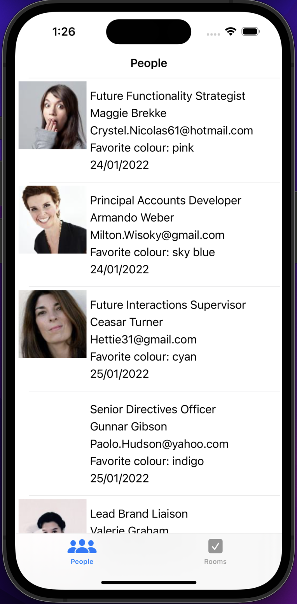
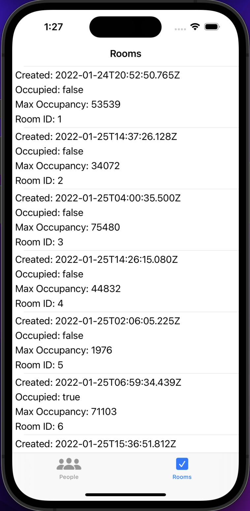

# DirectoryApp (MVVM)

IOS app using UIKit created by Mindaugas Balakauskas

## Description
  
Directory App is following MVVM architecture and calls https://61e947967bc0550017bc61bf.mockapi.io/api/v1/ API to show a list of the people and a list of the rooms. It also has a network module. The ViewModels covered by unit testing and FakeNetworkManager class is created for testing.

## Sample App

### Unit Test 
 
* used FakeNetworkManager class to input this class to mock api  behaviour 

## Requirements

- Xcode 13.6+
- Swift 5.2+

## Author

Mindaugas Balakauskas 
